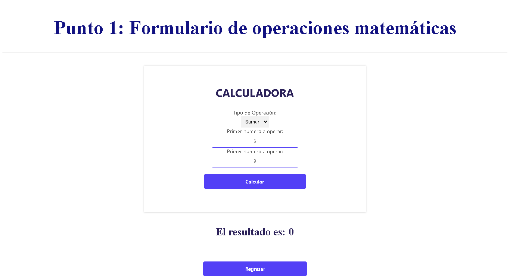
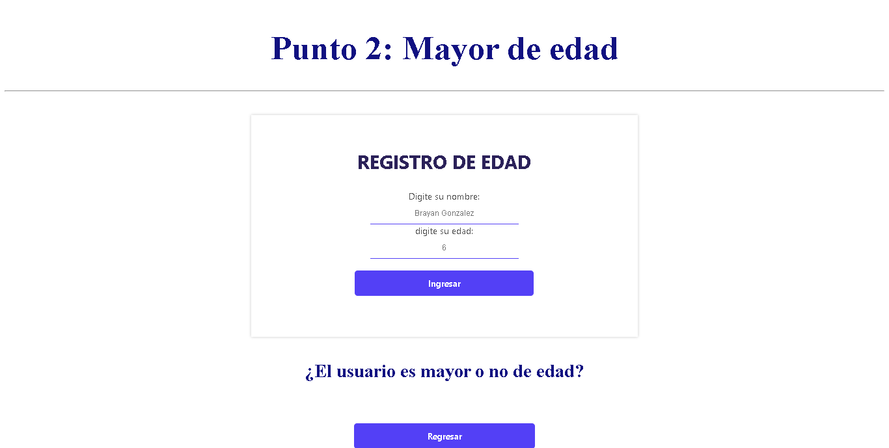
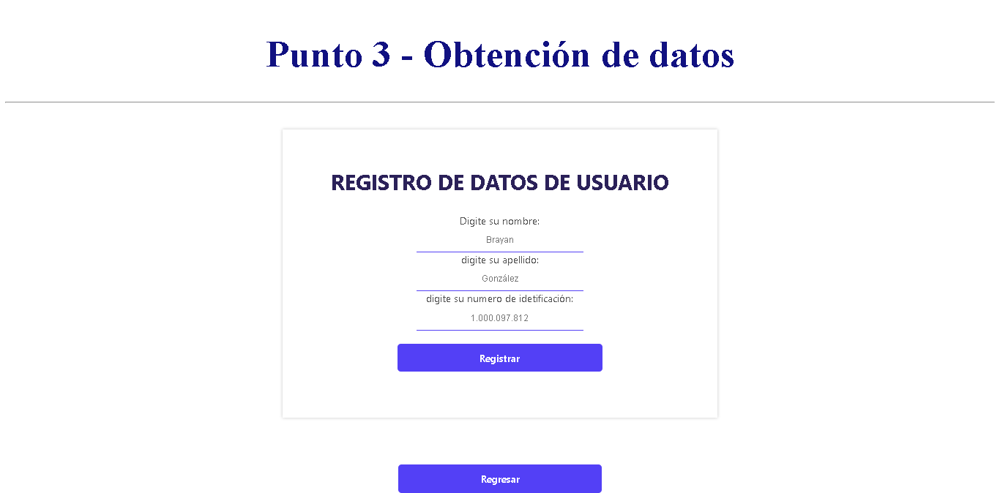
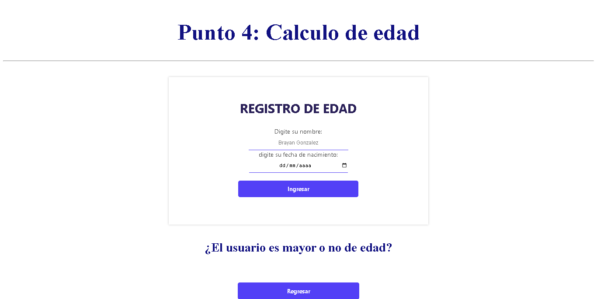
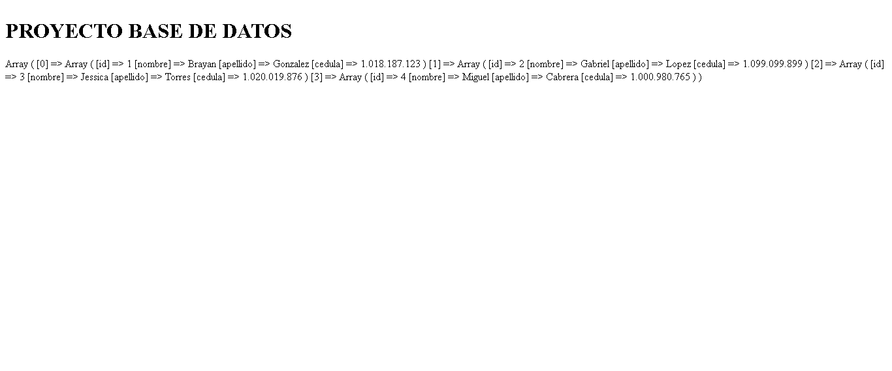
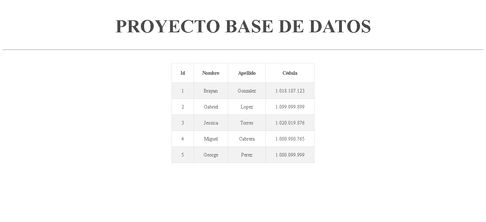

<H1> TALLER 10 <h1>
<h1>BRAYAN DAVID GONZALEZ NOVA</H1>

<h2>INFORMACIÓN</h2>
        
CURSO: Full Stack Básico - GRUPO 1

        
Profesor:  Cristian Patiño

<H2>Punto 1:  </H2>
  <h3> 1- CALCULADORA</h3>
    
<H2>Punto 2:  </H2>
  <h3> 2 - REGISTRO DE EDAD</h3>
    
<H2>Punto 3: REGISTRO DE USUARIOS  </H2>
    
<H3>Vista punto 3: VISTA DE REGISTRO DE USUARIOS  </H3>
    
<H2>Punto 4: CALCULO DE EDAD </H2>
    
<H2>Punto 5,6,7:  </H2>
  <h3> 5- BASE DE DATOS</h3>
    
  <h3> 6- CONEXION BASE DE DATOS</h3>
    
  <h3> 7- MUESTRA DE DATOS EN PANTALLA</h3>
    
