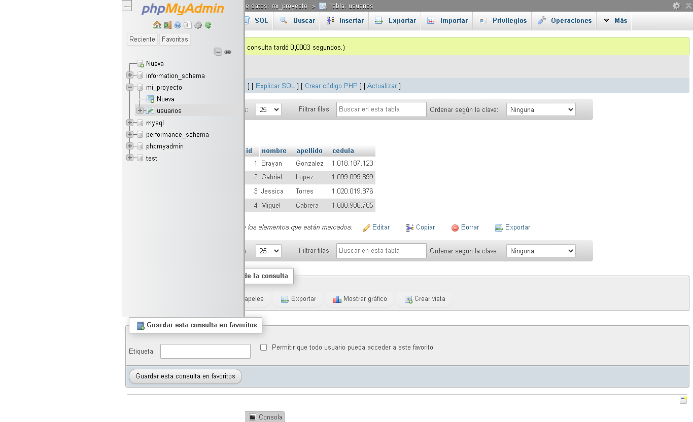

<H1> TALLER 10 <h1>
<h1>BRAYAN DAVID GONZALEZ NOVA</H1>

<h2>INFORMACIÓN</h2>
        
CURSO: Full Stack Básico - GRUPO 1

        
Profesor:  Cristian Patiño

<H2>Punto 1:  </H2>
<H2>Punto 2:  </H2>
<H2>Punto 3:  </H2>
<H2>Punto 4:  </H2>
<H2>Punto 5,6,7:  </H2>
  <h3> 5- BASE DE DATOS</h3>
    
